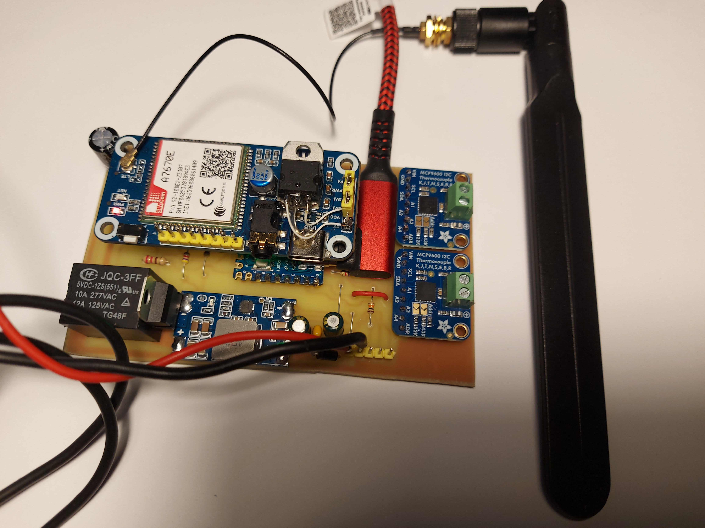

# Mondeo DPF Tracker

Mondeo DPF Tracker is firmware and electronics documentation for monitoring the DPF system in a Ford Mondeo MK4 2.0 TDCi.

The project was created to collect real-world data from DPF operation and regeneration: exhaust gas temperatures, differential pressure signal, dosing pump activity, glow plug state, and vehicle operating context. The collected telemetry is intended to help reconstruct the factory DPF behavior and prepare a control algorithm for another car.

Author: Marcin "Jaszczur" Kielesinski.

This project requires [JaszczurHAL](https://github.com/jaszczurtd/JaszczurHAL).

The firmware also requires a local `Credentials` Arduino library. A template is included in this project tree under `Credentials/`; for a normal Arduino build it should be placed in the sketchbook libraries directory as `libraries/Credentials`, matching Arduino's library discovery rules.

The physical tracker uses a Waveshare RP2040-Zero module. In practice the firmware only depends on RP2040 peripherals used through Arduino/JaszczurHAL, so it also builds and runs with compatible RP2040 board definitions such as Raspberry Pi Pico. Select the FQBN that matches the board support package and upload method used on the development machine.

## Build

The application uses portable app functions (`app_start()` / `app_task0()`), so there is no hand-written `.ino` file in the repository. CMake generates the small Arduino `setup()` / `loop()` wrapper under `.build/cmake/sketch/` and then calls `arduino-cli`.

The helper script reads local Arduino settings from `.vscode/settings.json`:

- `arduino.cliPath`
- `arduino.fqbn`
- `arduino.sketchbookPath`
- `arduino.uploadPort`
- `jaszczurhal.root`

That file is intentionally local and ignored by git. For a fresh checkout, create a minimal `.vscode/settings.json` first:

```json
{
    "arduino.cliPath": "arduino-cli",
    "arduino.fqbn": "rp2040:rp2040:waveshare_rp2040_zero",
    "arduino.sketchbookPath": "/path/to/arduino/sketchbook",
    "arduino.uploadPort": "/dev/ttyACM0",
    "jaszczurhal.root": "/path/to/libraries/JaszczurHAL"
}
```

After that, `./scripts/select-board.sh` or the VS Code board selection tasks can update the FQBN.

```bash
./scripts/configure-cmake.sh
cmake --build .build/cmake --target firmware
```

The default CMake fallback FQBN is `rp2040:rp2040:rpipico`, but `rp2040:rp2040:waveshare_rp2040_zero` also works fine. From the practical standpoint this makes no difference for this project.

The main generated artifacts are copied to `.build/firmware.elf`, `.build/firmware.bin`, `.build/firmware.uf2`, and `.build/firmware.map`.

## Developer Workflow

VS Code tasks and scripts use the same CMake targets:

- `Arduino: Build` / `cmake --build .build/cmake --target firmware`
- `Arduino: Build (Debug)` / `firmware_debug`
- `Arduino: Upload` / `./scripts/upload-serial.sh`
- `Arduino: Upload (UF2 / BOOTSEL)` / `./scripts/upload-uf2.sh`
- `Arduino: Monitor (persistent)` / `scripts/serial-persistent.py`
- `Arduino: Refresh IntelliSense` / `./scripts/refresh-intellisense.sh`
- `Arduino: Select board` / `./scripts/select-board.sh`

## Board Architecture

The tracker board is built as an RP2040-Zero based telemetry controller with a small set of automotive signal frontends. The RP2040 collects local measurements, timestamps the current operating state, and sends telemetry through an LTE modem to an MQTT broker.

Main hardware blocks:

- RP2040-Zero controller board running the tracker firmware.
- Two K-type EGT thermocouple inputs, each handled by an MCP9600 I2C thermocouple amplifier.
- Analog input for the DPF differential pressure sensor, read through the RP2040 ADC.
- GPIO interrupt inputs for dosing pump pulses and vaporizer glow plug state.
- LTE Cat-1 modem interface for remote telemetry and commands.
- Modem power control through a relay, allowing the firmware to hard-reset the modem when connectivity cannot be restored.
- On-board RGB status LED for connection, error, and publish activity feedback.

The electronics files are in `materials/DPF_tracker/`:

- Schematic: `materials/DPF_tracker/DPF_tracker.kicad_sch`
- Exported PDF: `materials/DPF_tracker/DPF_tracker.pdf`

## Modem

Connectivity is handled by a SIMCom A7670E / A7670X Cat-1 LTE modem. The modem is connected to the RP2040 over UART and is managed through JaszczurHAL's SIMCom A76xx driver.

The firmware brings up the modem, waits for SIM and network registration, attaches the PDP context, then opens an MQTT/TLS session. It publishes telemetry to `dpf/data`, queued control-signal events to `dpf/events`, status to `dpf/status`, and listens for commands on `dpf/cmd`. The current remote command contract includes `modem_reset`, which power-cycles the modem through the relay-controlled supply path.

The modem is also used as the source for network time, GNSS location, and cellular location context. GNSS is queried every 5 seconds when the modem is ready; cellular location is queried every 15 seconds.

## MQTT Telemetry

Telemetry is sampled as compact JSON every 2 seconds and queued in RAM for `dpf/data`. While MQTT is connected, the firmware drains this queue and removes each payload only after a successful publish. This keeps short MQTT outages from creating gaps in the slow temperature/pressure trend.

Core payload fields:

- `version` - firmware version.
- `time` - modem/network time when available.
- `egt_pre`, `egt_mid` - pre-DPF and mid-DPF exhaust gas temperatures.
- `dp_voltage`, `dp_raw` - DPF differential pressure sensor voltage and raw ADC value.
- `pump_onoff_period`, `pump_freq_hz`, `pump_cnt` - dosing pump frequency estimate and pulse count since the previous payload.
- `pump`, `pump_period_ms`, `pump_last_on_ms`, `pump_current_on_ms` - current pump state and ON timing.
- `glow`, `glow_dur`, `glow_current_on_ms` - vaporizer glow plug state and ON timing.
- `mcu_temp` - RP2040 internal temperature.
- `data_queue_len`, `data_overflow_count` - current state of the RAM telemetry queue.
- `event_queue_len`, `event_overflow_count` - current state of the RAM event queue.
- `ms` - firmware uptime in milliseconds.

GNSS fields include `gnss_valid`, `gnss_powered`, `gnss_error`, `gnss_age_ms`, `gnss_lat`, `gnss_lng`, `gnss_speed_kmh`, `gnss_alt_m`, `gnss_course_deg`, `gnss_hdop`, `gnss_sats_used`, `gnss_sats_view`, `gnss_fix_mode`, and `gnss_utc` when a fix has UTC data.

Cellular location fields include `cell_valid`, `cell_error`, `cell_age_ms`, `cell_speed_kmh`, and, when a cellular location is valid, `cell_lat`, `cell_lng`, and `cell_acc_m`. Cellular location is approximate operating context, not a precise GPS route.

Fast control-signal transitions are queued separately in a RAM ring buffer and published to `dpf/events` in batches. Events are removed from the queue only after a successful MQTT publish, so short MQTT outages do not lose pump/glow edge timing. Each event contains:

- `seq` - monotonic event sequence number.
- `t_us`, `t_ms` - firmware timestamp of the edge.
- `src` - `pump` or `glow`.
- `state` - `1` for ON, `0` for OFF.
- `gnss_speed_kmh` - latest GNSS vehicle speed captured when the edge was recorded, or `-1` when unavailable.
- `dp_voltage` - latest DPF differential pressure sensor voltage captured when the edge was recorded.
- `dp_sample_age_ms` - age of the `dp_voltage` sample at the event timestamp, or `-1` when unavailable.

The telemetry queue stores up to `DATA_QUEUE_CAPACITY` fixed-size payload slots, each limited by `DATA_PAYLOAD_MAX_SIZE`. The event batch also includes `queue_len`, `queue_remaining_after_batch`, and `overflow_count`. Both queues are finite; if either fills during a long outage, its overflow counter records that the in-RAM buffer was exhausted.

DPF regeneration cycle detection should be done by combining both streams. `dpf/data` is the regular slow telemetry stream for pressure, temperature, location, and long-term state trends. `dpf/events` is the precise actuator edge stream for reconstructing pump and glow plug timing. Start/end conditions should primarily come from the pressure and temperature trends in `dpf/data`, while `dpf/events` describes what the factory controller did during that cycle.

The status topic `dpf/status` publishes `{"status":"online"}` after MQTT connection. If the previous application boot was caused by a real watchdog timeout, the firmware also publishes one watchdog status payload, for example `{"status":"watchdog_reset","reason":"watchdog","version":"v0.4","ms":12345}`. Other reset causes are not reported as status events. The command topic `dpf/cmd` accepts the plain text command `modem_reset`.

## Thermocouples

The board uses two K-type thermocouple channels for exhaust gas temperature measurement:

- pre-DPF EGT probe,
- mid-DPF EGT probe.

Both probes are read through MCP9600 I2C thermocouple amplifiers on the shared I2C bus. The firmware configures them as K-type sensors with high ADC resolution, ambient compensation, filtering, and publishes the resulting values as `egt_pre` and `egt_mid`.


